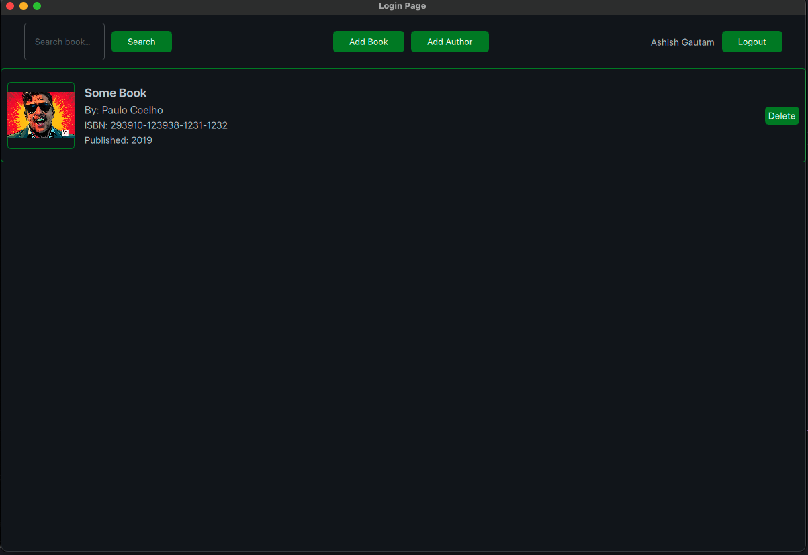

# BOOKSY

**Book Organization and Optimized Knowledge Storage for You**

BOOKSY is a sophisticated Book Management System developed using Python and Qt, designed to help users organize and manage their book collections efficiently.

## Features

- **Add, Delete Books**: Manage your book collection with ease.
- **Search Books**: Quickly find books based on various criteria.
- **User-Friendly Interface**: Intuitive UI built with Qt for a seamless experience.
- **Data Persistence**: Save and load your book collection effortlessly.

## Screenshots




## Installation

### Prerequisites

- Python 3.8+
- PyQt5

### Steps

1. **Clone the Repository**

    ```bash
    git clone https://github.com/silentashish/Book-Management-Syatem.git
    cd Book-Management-Syatem
    ```

2. **Create a Virtual Environment**

    ```bash
    python -m venv venv
    source venv/bin/activate  # On Windows: venv\Scripts\activate
    ```

3. **Install Dependencies**

    ```bash
    pip install -r requirements.txt
    ```

4. **Run the Application**

    ```bash
    python main.py
    ```

## Requirements

- Python 3.8+
- PyQt5
- Other dependencies listed in `requirements.txt`

